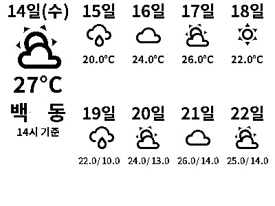

# hass-gicisky
Gicisky BLE Label Home Assistant Integration

## 💬 Feedback & Support

🐞 Found a bug? Let us know via an [Issue](https://github.com/eigger/hass-gicisky/issues).  
💡 Have a question or suggestion? Join the [Discussion](https://github.com/eigger/hass-gicisky/discussions)!


## Supported Models
- TFT 2.1" BW
- EPD 2.1" BWR
- EPD 2.9" BWR
- EPD 4.2" BWR
- EPD 7.5" BWR

## Installation
1. Install this integration with HACS (adding repository required), or copy the contents of this
repository into the `custom_components/gicisky` directory.
2. Restart Home Assistant.

## ⚠️ Important Notice
- It is **strongly recommended to use a Bluetooth proxy instead of a built-in Bluetooth adapter**.  
  Bluetooth proxies generally offer more stable connections and better range, especially in environments with multiple BLE devices.
- When using a Bluetooth proxy, it is strongly recommended to **keep the scan interval at its default value**.  
  Changing these values may cause issues with Bluetooth data transmission.
- **bluetooth_proxy:** must always have **active: true**.
  
  Example (recommended configuration with default values):

  ```yaml
  esp32_ble_tracker:
    scan_parameters:
      #interval: 1100ms
      #window: 1100ms
      active: true
  
  bluetooth_proxy:
    active: true


## Examples
| Size | Example | Preview | Yaml |
|------|---------|---------|------|
| 2.1" | Date |  | [2.1" Date](./examples/2.1-date.yaml) |
| 2.1" | Naver Weather |  | [2.1" Naver Weather](./examples/2.1-naver-weather.yaml) |
| 2.1" | Wifi |  | [2.1" Wifi](./examples/2.1-wifi.yaml) |
| 2.1" | TMap time |  | [2.1" TMap time](./examples/2.1-tmap-time.yaml) |
| 2.9" | Google Calendar |  | [2.9" Google Calendar](./examples/2.9-google-calendar.yaml) |
| 4.2" | Image |  | [4.2" Image](./examples/4.2-image.yaml) |
| 4.2" | Naver Weather |  | [4.2" Naver Weather](./examples/4.2-naver-weather.yaml) |
| 7.5" | Image |  | [7.5" Image](./examples/7.5-image.yaml) |
| 7.5" | Google Calendar |  | [7.5" Google Calendar](./examples/7.5-google-calendar.yaml) |
```
action: gicisky.write
data:
  payload:
    - type: text
      value: Hello World!
      x: 10
      y: 10
      size: 40
    - type: barcode
      data: "12345"
      code: "code128"
      x: 10
      y: 10
    - type: icon
      value: account-cowboy-hat
      x: 6
      y: 12
      size: 12
    - type: dlimg
      url: "https://image url.png" or "/config/www/images/image.png"
      x: 10
      y: 10
      xsize: 12
      ysize: 12
    - type: qrcode
      data: "qr data"
      x: 140
      y: 50
      boxsize: 2
      border: 2
target:
  device_id: <your device>
```
## [Gicisky Image Edit & Uploader](https://eigger.github.io/Gicisky_Image_Uploader.html)

## T-Map
```
#https://openapi.sk.com/products/detail?linkMenuSeq=46
rest_command:
  request_tmap_routes:
    url: https://apis.openapi.sk.com/tmap/routes?version=1
    method: POST
    headers:
      appKey: !secret tmap_api_key
      accept: "application/json, text/html"
    content_type: "application/json; charset=utf-8"
    payload: >-
      {
        "startX": {{ startX }},
        "startY": {{ startY }},
        "endX": {{ endX }},
        "endY": {{ endY }},
        "searchOption": {{ searchOption }},
        "totalValue": 2,
        "trafficInfo ": "Y",
        "mainRoadInfo": "Y",
      }
```

## Google Calendar
```
Remote Calendar -> Add google *.ics
```

## Third-Party Custom Components
- [Naver Weather (minumida)](https://github.com/miumida/naver_weather.git)
  
## References
- [ATC GICISKY ESL (atc1441)](https://github.com/atc1441/ATC_GICISKY_ESL.git)
- [OpenEPaperLink](https://github.com/OpenEPaperLink/Home_Assistant_Integration.git)
- [bthome](https://github.com/home-assistant/core/tree/dev/homeassistant/components/bthome)
- [bthome-ble](https://github.com/Bluetooth-Devices/bthome-ble.git)
